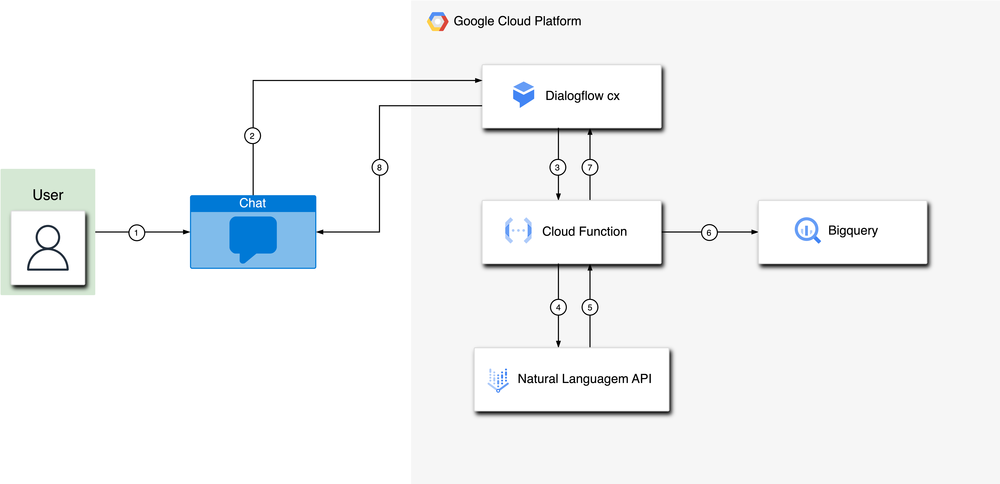
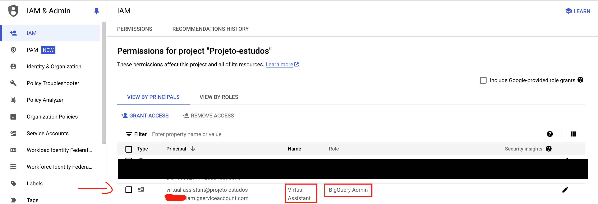
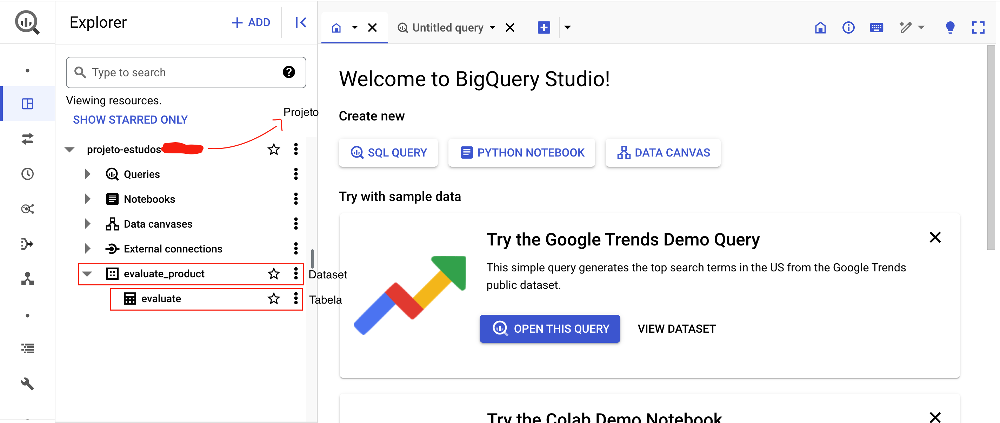
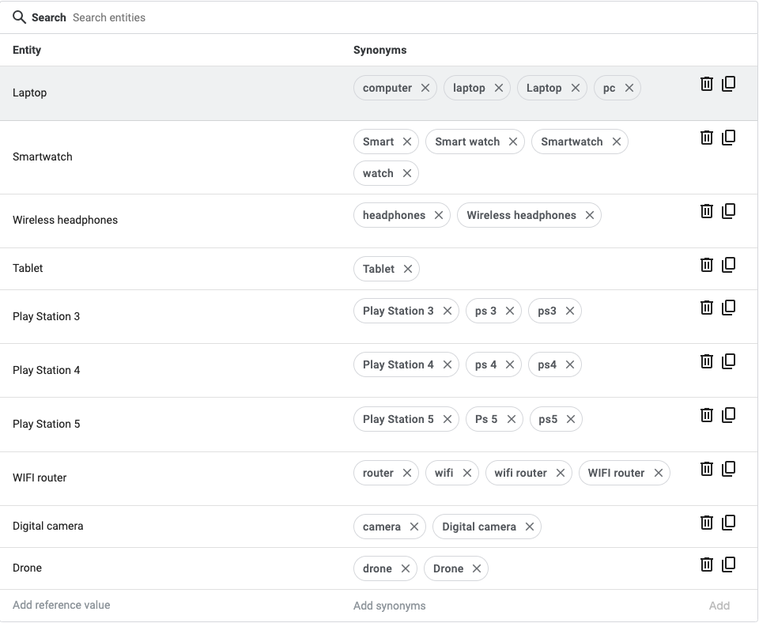
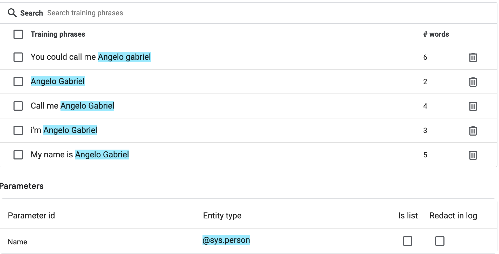
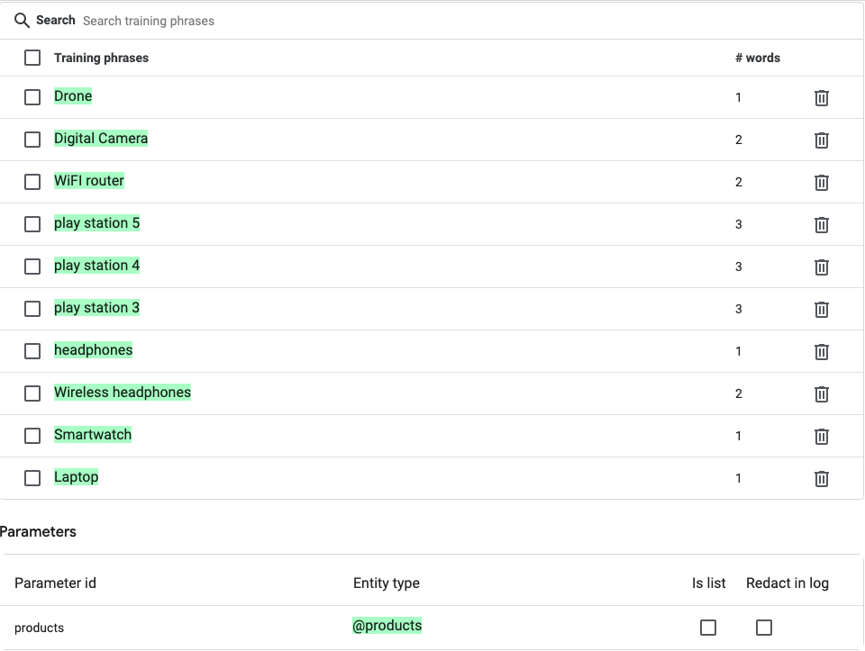
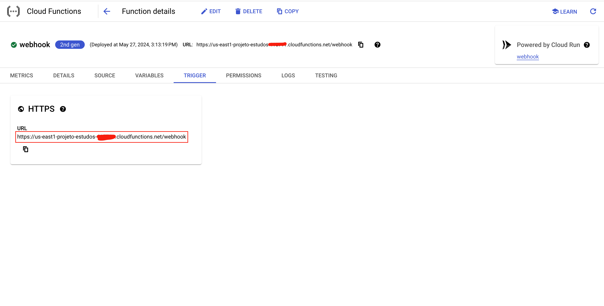

# Chatbot de análise de sentimentos
Esse projeto se trata de um chatbot construído no Dialogflox CX que usa a ferramenta **Natural Language AI** para analisar a avaliação de um determinado produto da loja ficticia **FagTec**, uma loja de aparelhos eletronicos.

## Arquitetura do projeto


1. O usuário manda uma mensagem pelo prompt de um chat
2. Essa mensagem é encaminhado para o Dialogflox CX, e responde com base nas intenções, entidades, páginas e fluxos configurados
3. O Dialogflow envia a avaliação feita pelo usuário para a Cloud Function
4. A Cloud Function passa a avaliação para a Natural Languagem API
5. A Natural Languagem API retorna um objeto com a analise de sentimento (de -1 a 1) de volta para a Cloud Function
6. A Cloud Function salva o nome, a avaliação, o produto avaliado e o score analisado em uma tabela no BigQuery
7. A Cloud function retorna uma mensagem para o Dialogflow CX
8. O Dialogflow CX exibe a mensagem ao chat do usuário 

## Etapas do desenvolvimento
### Service Account
Primeiro, vamos criar uma service account para a nossa Cloud Function, para que ela possa ter acesso ao BigQuery
- Para criar a Service Account, execute o seguinte comando
```sh
gcloud iam service-accounts create virtual-assistant \
  --description="Service account that will be used in the Cloud Function to access BigQuery" \
  --display-name="Virtual Assistant"
```
- Agora, para atribuir a permissão de **BigQuery Admin** a Service Account, execute o seguinte comando:
```sh
gcloud projects add-iam-policy-binding $DEVSHELL_PROJECT_ID \
  --member="serviceAccount:virtual-assistant@$DEVSHELL_PROJECT_ID.iam.gserviceaccount.com" \
  --role="roles/bigquery.admin"
```
Agora, na console da Google Cloud, vá para <a href="https://console.cloud.google.com/iam-admin/iam?referrer=search">iam & admin</a>. Na seção IAM, podemos visualizar nossa Service account criada, com a permissão Bigquery Admin



### BigQuery
Agora, para configurar o BigQuery, vamos:
- No Cloud Shell, execute esse comando para criar um dataset no BigQuery chamado **evaluate_product**
```sh
bq mk evaluate_product
```
- Agora, execute o seguinte comando para criar uma tabela dentro do dataset criado
```sh
bq mk --table $DEVSHELL_PROJECT_ID:evaluate_product.evaluate Name:string,Product:string,Text:string,Score:float
```
  - Esse comando vai criar uma tabela com as seguintes schemas:
    - Name do tipo string para armazenar o nome da pessoa que irá fazer a avaliação
    - Product do tipo string para armazenar o produto avaliado
    - Text do tipo string para armazenar a avaliação enviada pelo usuário
    - Score como float que vai armazenar o valor de -1 a 1, referente a analise feita na avaliação enviada pelo usuário
      - Quanto menor o número (mais próximo de -1), pior a avaliação
  - O **$DEVSHELL_PROJECT_ID** é uma variável de ambiente que armazena do ID do seu projeto dentro da Google Cloud Platform

Agora, na console da Google Cloud, vá para <a href="https://console.cloud.google.com/bigquery">BigQuery</a> e visualize o dataset e tabela criado



### Cloud Function
Agora, vamos criar uma cloud function para servir como Webhook do nosso agente virtual

Para criar uma cloud function, vamos executar o seguinte comando:
```sh
gcloud functions deploy webhook \
    --gen2 \
    --runtime=python312 \
    --region=us-east1 \
    --source=./cloud_function \
    --entry-point=analyze_webhook \
    --trigger-http \
    --service-account virtual-assistant@$DEVSHELL_PROJECT_ID.iam.gserviceaccount.com
```
- Esse comando irá criar uma cloud function com a runtime em Python3.12, com o entry-point analyze_webhook (nome da função principal do código python), e com a service account criado anteriormente. 
O código python que usaremos nesse projeto se encontra [nesse arquivo](./cloud_function/main.py) e as dependências utilizadas por esse código se encontra [nesse arquivo](./cloud_function/requirements.txt)

### Criação do Agente Virtual
- Primeiro, vamos nos serviços de <a href="https://dialogflow.cloud.google.com/cx/">Dialogflow CX</a>
- Vamos em "**Create agent**" e depois em "**Build your own**"
- Vamos colocar o Display Name como **Evaluator.io** e em Location vamos colocar como **Global**

**<a id="create_entity"></a>Criando as entidades (Entity Types)**
- Vamos clicar em Manage na console do Dialogflow
- Vamos na secão Entity Types
- Clique em **Create** e coloque o nome como **products**
- Em products, teremos as seguintes unidades:



**Configuração das intenções (Intents)**
- Vamos clicar em Manage na console do Dialogflow
- Vamos na secão Intents
- Clique em **Create**
  - A primeira intenção vai ter o nome "**confirmation.yes** com as seguintes frases:
    - let's go
    - Go
    - Please
    - I want to evaluate the product
    - I want to evaluate
    - y 
    - Of course
    - Sure
    - yes
  - A Segunda intenção vai ter o nome "**confirmation.no** com as seguintes frases:
    - I don't want
    - I don't
    - no, thanks
    - Never
    - Do not
    - Not 
    - No
  - A Terceira intenção vai ter o nome "**information.name** com as seguintes frases:
    - You could call me Angelo Gabriel
    - Angelo Gabriel
    - Call me Angelo Gabriel
    - I'm Angelo Gabriel
    - My name is Angelo Gabriel
    
    - Nesse caso, Podemos colocar qualquer nome
    - OBSERVAÇÃO: Colocar a entidade dessa intenção como **@sys.person**
  - A Quarta intenção vai ter o nome "**information.products** com as seguintes frases:
    - Drone
    - Digital Camera
    - WiFi router
    - Play Station 5
    - Play Station 4
    - Play Station 3
    - headphones
    - Wireless headphones
    - Smartwatch
    - Laptop
    
      
    
    - OBSERVAÇÃO: Colocar a entidade dessa intenção como **@products**, entidade criada [aqui](#create_entity)
  
**Configurar o webhook**
- Vamos clicar em Manage na console do Dialogflow
- Vamos na secão **Webhooks**
- Vamos clicar em **Create**
  - Em Display name, vamos colocar qualquer nome (nesse caso, vou chamar de webhook)
  - Em Webhook URL, vamos colocar a URL pública da Cloud Function
  - Vamos clicar em Save
    
  
  - Para "pegar" a url da cloud function, vá no serviço de Cloud Function e clique na função criada
    

### Criando as páginas, fluxos e rotas
A página inicial terá um mensagens de boas vindas, e dando a possibilidade ao usuário de responder se ele gostaria de avaliar algum produto ou não.
- Se o usuário responder com um "yes", será direcionado para o fluxo "Product Review"
- Se o usuário responder com um "no", será direcionado para o fim da sessão

O fluxo Product review tem 4 páginas
- A página inicial que vai capturar o nome do usuário
- A página de seleção do produto para avaliar
  - Nessa página, o usuário é obrigado a fornecer o nome do produto, caso o contrário o bot não irá prosseguir
- A página de avaliacão do produto, onde o usuário vai fazer o review
  - Nessa página, foi configurado um "No-match 1", para que não haja correspondência com nada que o usuário disser, e automaticamente acione o webhook.
  - O Webhook irá retornar uma resposta automatica com base no nível de satisfação do usuário
- A página End Session diz respeito ao fim da conversa

### Explorando o código em python
```py
import functions_framework
from flask import jsonify
from google.cloud import language_v1
from google.cloud import bigquery
from typing import Dict

def natural_language(name, text,product):
    client = language_v1.LanguageServiceClient()
    document = language_v1.types.Document(
      content=text, type_=language_v1.types.Document.Type.PLAIN_TEXT
    )
    sentiment = client.analyze_sentiment(request={"document": document}).document_sentiment
    analyze_iter = iter(["name", name ,"product", product, "text", text, "sentiment_score", f"{sentiment.score:.2f}", "sentiment_magnitude", f"{sentiment.magnitude:.2f}"])
    analyze: Dict[str, str] = {}

    for analyze_name in analyze_iter:
        analyze[analyze_name] = next(analyze_iter)

    response_user = ""
    if float(analyze["sentiment_score"]) < -0.5:
        response_user = "We're sorry you didn't like it. We'll work to improve."
    elif float(analyze["sentiment_score"]) >= -0.5 and float(analyze["sentiment_score"]) < 0:
        response_user = "We're sorry it wasn't a good experience for you. We'll work to improve."
    elif float(analyze["sentiment_score"]) >= 0 and float(analyze["sentiment_score"]) < 0.6:
        response_user = "We're glad you enjoyed it! Your feedback is important for us to improve."
    elif float(analyze["sentiment_score"]) >= 0.6:
        response_user = "We're happy to hear you had a great experience."
    
    return analyze,response_user

def write_data_bq(analyzed_text):
    client = bigquery.Client()
    dataset_id = "projeto-estudos-415711.evaluate_product.evaluate"
    QUERY = f"""
        INSERT INTO `{dataset_id}` (Name, Product, Text, Score) VALUES ("{analyzed_text["name"]}","{analyzed_text["product"]}","{analyzed_text["text"]}",{analyzed_text["sentiment_score"]})
    """
    client.query_and_wait(QUERY)

@functions_framework.http
def analyze_webhook(request):
    data = request.get_json()

    print(data)

    tag = data["fulfillmentInfo"]["tag"]
    text = data["text"]
    name = data["sessionInfo"]["parameters"]["name"]["name"]
    product = data["sessionInfo"]["parameters"]["product"]

    analyzed_text, response_user = natural_language(name,text,product)
    write_data_bq(analyzed_text)

    return jsonify(
        {
            'fulfillment_response': {
                'messages': [
                    {
                        'text': {
                            'text': [response_user]
                        }
                    }
                ]
            }
        }
    )
```

Esse código em questão vai receber a avaliação do usuário, assim como o seu nome e o nome do produto que ele está avaliando. Após isso, ele vai realizar a análise do texto e retornar um score de -1 a 1, e também uma resposta ao usuário com base nesse score. A função **write_data_bq** vai escrever a avaliação, o nome do usuário, o nome do produto e o score em um dataset dentro do BigQuery. E, por fim, o código vai fornecer um texto de resposta com base na avaliação para o Bot no DialogFlow
